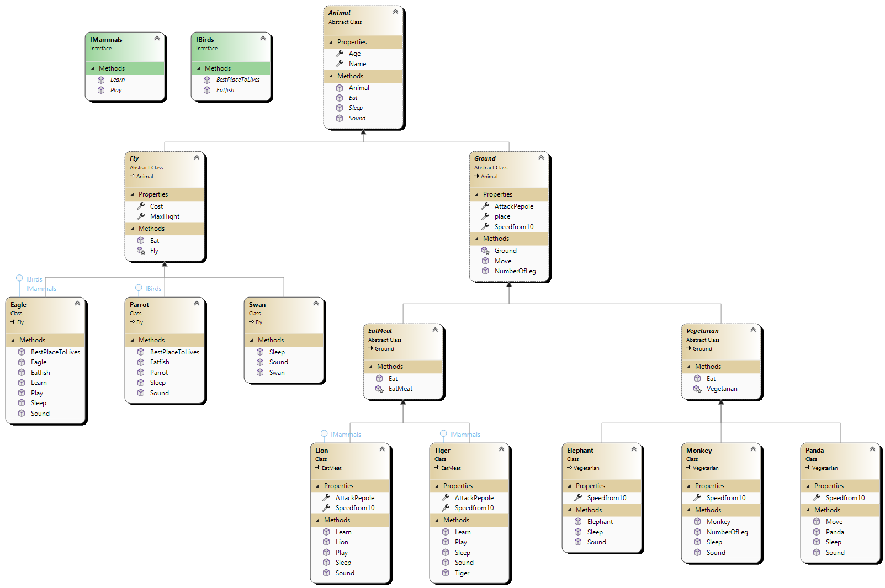

# Zoo Management System

## Introduction
 zoo contains animals, and animals can come in many different shapes and sizes.
## Digital UML Diagram

## Object-Oriented Programming Principles

### Inheritance
Inheritance is a fundamental OOP principle that allows classes to inherit properties and behaviors from a base class. In our project, we have utilized inheritance to establish a hierarchical structure for animal classes. For example, the `Animal` base class provides common properties such as `Name` and `Age`, while the derived classes like `Eagle` and `Lion` inherit these properties and define their own specific behaviors.

### Encapsulation
Encapsulation is the principle of bundling data and methods together within a class and controlling access to them through access modifiers. In our project, each animal class encapsulates its specific properties and methods. For instance, the `Animal` class encapsulates the `Name` and `Age` properties along with abstract methods like `Eat()`, `Sound()`, and `Sleep()`. This ensures that the internal details of an animal are hidden and can only be accessed through defined interfaces.

### Polymorphism
Polymorphism allows objects of different classes to be treated as objects of a common base class. It enables flexibility and extensibility in our project by allowing us to work with different animal objects using a common interface. For example, we can have a list of animals and iterate through them, calling the `Sound()` method. Each animal, whether it's an `Eagle` or a `Lion`, can provide its own implementation of the `Sound()` method, which is called dynamically based on the actual object type.

### Abstraction
Abstraction focuses on representing the essential features and behavior of an object, while hiding the unnecessary details. In our project, we use abstraction through abstract classes and methods. The `Animal` class is an abstract class that defines common properties and abstract methods that must be implemented by its derived classes. This allows us to define a common blueprint for animals without worrying about the specific implementation details.

## Examples of OOP in the Project

- Inheritance: The `Eagle` class inherits from the `Fly` class, which in turn inherits from the `Animal` class. This allows the `Eagle` class to inherit the properties and methods defined in both the `Fly` and `Animal` classes.
- Encapsulation: Each animal class encapsulates its specific properties, such as `Name` and `Age`, as well as its behavior methods like `Sound()` and `Sleep()`. These details are encapsulated within the respective classes and can only be accessed through defined interfaces.
- Polymorphism: We can create a list of animals and store objects of different animal classes in it. Then, we can iterate through the list and call the `Sound()` method on each animal. The actual implementation of the `Sound()` method will be dynamically determined based on the specific animal object being processed.
- Abstraction: The `Animal` class is an abstract class that defines common properties and abstract methods. This provides a level of abstraction where we can work with animals in a general sense without worrying about the specific details of each animal type.

## Interfaces

# Interfaces in Object-Oriented Programming

An interface, in simple terms, is a blueprint or contract that defines a set of methods, properties, and events that a class must implement. It defines the behavior that a class should have without specifying how that behavior is implemented. In other words, an interface specifies what a class can do, but not how it does it.

In the context of a zoo scenario, I have used the following interfaces:

## IBirds

The `IBirds` interface is implemented by classes such as `Eagle`, `Parrot`, and `Bird`. It defines methods like `BestPlaceToLives()` and `Eatfish()`, which represent the behavior specific to birds.

## IMammals

The `IMammals` interface is implemented by classes such as `Lion`, `Tiger`, and `Mammal`. It defines methods like `Play()` and `Learn()`, which represent the behavior specific to mammals.

## Animal

The `Animal` interface is implemented by classes such as `Eagle`, `Lion`, `Tiger`, and `Mammal`. It serves as a base interface that defines common methods and properties that all animals should have, such as `Sleep()` and `Sound()`.

By using interfaces, we ensure that the classes implementing them adhere to a specific set of behaviors and functionality. This promotes better organization, modularity, and code reusability. Interfaces also enable polymorphism, allowing objects of different classes that implement the same interface to be treated uniformly.

Interfaces are a powerful mechanism in object-oriented programming, providing contracts for classes to implement behavior and facilitating code reuse and modularity.

